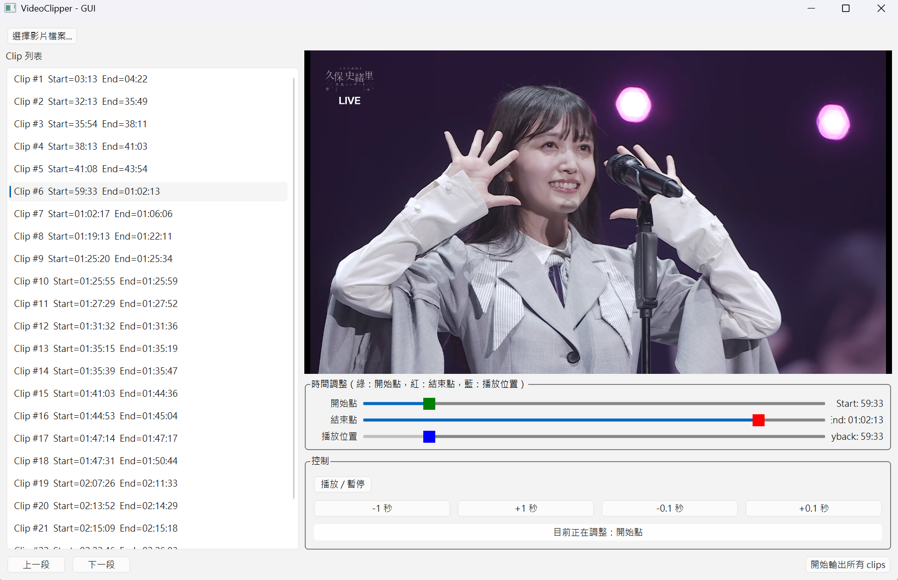

# VideoClipper

VideoClipper is a lightweight tool that lets you mark video clips while watching in PotPlayer, then review and export all clips through a simple GUI.  
It streamlines the workflow of watching → marking → exporting without interrupting playback or manually recording timestamps.

---

## Overview

VideoClipper consists of two main components:

### 1. background_marker.exe

When PotPlayer is the active window, pressing the middle mouse button records the current playback timestamp.  
The timestamps are saved into a `.marks` file located in:

```
VideoClipper/VideoMarks/
```

A `.marks` file looks like this:

```
03:13, start
04:22, end
32:13, start
35:49, end
01:02:17, start
01:06:06, end
...
```

Each pair of lines represents one clip segment.

### 2. gui_app.exe

After watching the video, you open the GUI to load the video file and its `.marks` file.  
The GUI displays all detected segments, allows optional fine adjustments using sliders and buttons, and finally exports all clips at once.

If no `.marks` file is found, the GUI switches to manual mode, allowing fully manual clip creation and adjustment.

---

## Installation

VideoClipper provides pre-built Windows executables.  
Users do not need Python or any development dependencies.

Simply download the release package and follow the usage instructions below.

### Folder Structure (Release v0.2.0)

After downloading Release v0.2.0, prepare the files in the following structure:

```
VideoClipper/
└─ dist/
   ├─ background_marker.exe
   └─ gui_app.exe
```

Then run:

```
VideoClipper/dist/background_marker.exe
VideoClipper/dist/gui_app.exe
```

---

## Usage Workflow

VideoClipper follows a simple two-step process:

### Step 1. Start the background marker (optional)

Run:

```
VideoClipper/dist/background_marker.exe
```

Keep it running in the background.

---

### Step 2. Watch and mark in PotPlayer (optional)

Play the video in PotPlayer.

Whenever you want to mark a segment:

- Press the middle mouse button slightly **before** the segment begins → records a `start`
- Press the middle mouse button slightly **after** the segment ends → records an `end`

A `.marks` file will be created automatically in:

```
VideoClipper/VideoMarks/
```

Example:

```
VideoClipper/VideoMarks/MyVideo.marks
```

Contents:

```
03:13, start
04:22, end
32:13, start
35:49, end
...
```

---

### Step 3. Load and export clips in the GUI

Before opening the GUI, make sure the video file and its `.marks` file are located in the same folder.

Run:

```
VideoClipper/dist/gui_app.exe
```

In the GUI:



- Click **「選擇影片檔案...」** and choose the video you watched.
- After processing, all segments (Clip #1, Clip #2, …) will appear in the left sidebar.
- You may fine-tune each segment using:
  - Click **「目前正在調整: 開始點」 / 「目前正在調整: 結束點」** to select which point to adjust.
  - Green slider: start position
  - Red slider: end position
  - Blue slider: seek within the preview
  - ±1s and ±0.1s buttons for precise adjustments

If you do not wish to adjust anything, you may export directly.

---

## Manual Mode (No `.marks`)

If the selected video does not have a corresponding `.marks` file:

- The GUI automatically enters manual mode
- A default clip is created:
  - Start = beginning of the video
  - End = end of the video
- The entire video duration is used as the adjustment window

In manual mode, you can:

- Adjust the start and end boundaries freely
- Add additional clips manually
- Export clips in the same way as marked clips

---

## Output Location

All exported clips are placed **in the same folder as the video and its `.marks` file**, for example:

```
~/MyVideo.mp4
~/MyVideo.marks
~/clip_001.mp4
~/clip_002.mp4
...
```

---

## Build (for Developers)

To build the executables manually:

1. Place `ffmpeg.exe` back into:

```
bin/ffmpeg.exe
```

2. Build the background marker:

```
pyinstaller --onefile .\run_background_marker.py
```

3. Build the GUI application:

```
pyinstaller --onefile --clean --add-binary "bin\ffmpeg.exe;bin" .\run_gui_app.py
```

The resulting executables will be:

```
run_background_marker.exe
run_gui_app.exe
```

---

## Important Notes

- The background marker only records timestamps when PotPlayer is the foreground window.
- The video file and its `.marks` file **must** be in the same folder before loading in the GUI.
- Segment marking has no undo function; each middle-mouse press is permanently recorded.
- Nested segments (a clip inside another clip) are not supported.
