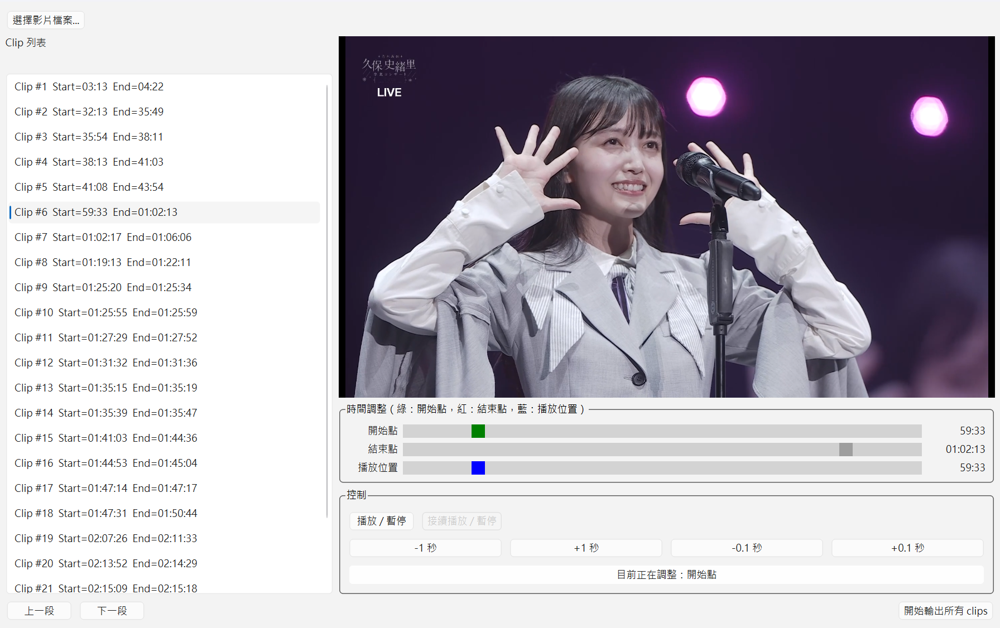

# VideoClipper

VideoClipper is a lightweight tool that lets you mark video clips while watching in PotPlayer, then review and export all clips through a simple GUI.  
It streamlines the workflow of watching → marking → exporting without interrupting playback or manually recording timestamps.

---

## Overview

VideoClipper consists of two main components:

### 1. background_marker.exe

When PotPlayer is the active window, pressing the middle mouse button records the current playback timestamp.  
The timestamps are saved into a `.marks` file located in:

```
VideoClipper/VideoMarks/
```

A `.marks` file looks like this:

```
03:13, start
04:22, end
32:13, start
35:49, end
01:02:17, start
01:06:06, end
...
```

Each pair of lines represents one clip segment.

### 2. gui_app.exe

After watching the video, you open the GUI to load the video file and its `.marks` file.  
The GUI displays all detected segments, allows optional fine adjustments using sliders and buttons, and finally exports all clips at once.

If a corresponding `.marks` file **can not be found**, the GUI switches to manual mode, allowing fully manual clip creation and adjustment.

---

## Installation

VideoClipper provides pre-built Windows executables.  
Users do not need Python or any development dependencies.

Simply download the latest release package and follow the usage instructions below.

### Folder Structure (Release)

After downloading the latest **Release**, prepare the files in the following structure:

```
VideoClipper/
└─ dist/
   ├─ background_marker.exe
   └─ gui_app.exe
```

---

## Usage Workflow

VideoClipper follows a simple workflow from marking to exporting.

### Step 0. Install and configure PotPlayer

- Install PotPlayer if it is not already installed.

- Configure the middle mouse button in PotPlayer:
   1. Open PotPlayer and press `F5` to open **偏好設定**.
   2. Navigate to **一般 → 鍵盤**.
   3. Click **新增** to create a new hotkey.
   4. Click the shortcut input field, then press the **滑鼠中鍵** to assign it.
   5. For the action, select: **其他 → 複製目前播放時間到剪貼簿**.  

---

### Step 1. Start the background marker (optional)

Run:

```
VideoClipper/dist/background_marker.exe
```

Keep it running in the background.

---

### Step 2. Watch and mark in PotPlayer (optional)

- Play the video in PotPlayer.

- Whenever you want to mark a segment:

   - Press the middle mouse button slightly **before** the segment begins → records a `start`
   - Press the middle mouse button slightly **after** the segment ends → records an `end`

A `.marks` file will be created automatically in:

```
VideoClipper/VideoMarks/
```

Example:

```
VideoClipper/VideoMarks/MyVideo.marks
```

Contents:

```
03:13, start
04:22, end
32:13, start
35:49, end
...
```

---

### Step 3. Load and export clips in the GUI

Before opening the GUI, make sure the video file is located in the same folder as its `.marks` file (if available).

Run:

```
VideoClipper/dist/gui_app.exe
```

In the GUI:



- Click **「選擇影片檔案...」** and choose the target video.
- After processing, all segments will appear in the left sidebar as:
  - `Clip #1`, `Clip #2`, …

- You may use the following playback controls to review each clip:

   #### Play button behavior
   
   - If **「目前正在調整: 開始點」**, pressing **「播放/暫停」** starts playback from the **clip start position**.
   - If **「目前正在調整: 結束點」**, pressing **「播放/暫停」** starts playback from **approximately 3 seconds before the clip end**.
   
   #### Continue Playback
   
   - Pressing **「接續播放/暫停」** resumes video playback from the **current playback position**.
   
   #### Blue seek slider
   
   - After playback starts, you can use the blue slider to adjust the **current playback position**.

- You may also fine-tune each segment using:

   - **「目前正在調整: 開始點 / 結束點」** to select which point to adjust
   - Green slider: start position  
   - Red slider: end position  
   - ±1s and ±0.1s buttons for precise adjustments  

If you do not wish to adjust anything, you may export directly.

---

## Manual Mode

If a corresponding `.marks` file **can not be found**, the GUI automatically enters manual mode.

In manual mode, you can:

- Adjust the start and end boundaries freely
- Export clips in the same way as marked clips

Regardless of whether a `.marks` file exists, you may **manually add new clips at any time**.

### Add a new clip

To add a new clip manually:

- Click the **Add Clip** button at the bottom-right corner of the GUI
- The GUI will prompt you to confirm the creation of a new clip
- A new clip will be created and can then be adjusted in the same way as other clips

---

## Output Location

All exported clips are placed in the same folder as the original video file, for example:

```
~/MyVideo.mp4
~/clip_001.mp4
~/clip_002.mp4
...
```

---

## Build (for Developers)

To build the executables manually:

### Prepare ffmpeg

Download ffmpeg from the official website:

```
https://ffmpeg.org/download.html
```

Download the **ffmpeg-git-full.7z** and unzip.

After extracting the archive, copy `ffmpeg.exe` to the following location in the repository:

```
bin/ffmpeg.exe
```

---

### Build executables

1. Build the background marker:

```
pyinstaller --onefile .\run_background_marker.py
```

2. Build the GUI application:

```
pyinstaller --onefile --clean --add-binary "bin\ffmpeg.exe;bin" .\run_gui_app.py
```

The resulting executables will be:

```
run_background_marker.exe
run_gui_app.exe
```

---

## Important Notes

- The background marker only records timestamps when PotPlayer is the foreground window.
- Segment marking has no undo function; each middle-mouse press is permanently recorded.
- Nested segments (a clip inside another clip) are not supported.
